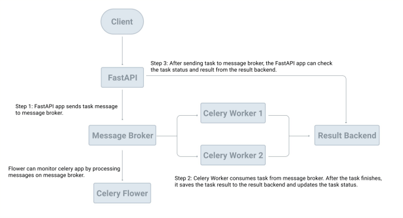

# Fastapi Celery Template

```bash
$ git clone https://github.com/Madi-S/fastapi-celery-template
$ docker-compose up --build -d
```

## Why Celery?

Celery is an open source, asynchronous task queue that is often coupled with Python-based web frameworks like FastAPI, Django or Flask to manage background work outside the typical request/response cycle In other words, you can return an HTTP response back immediately and run the process as a background task instead of forcing the user to wait for the task to be finished.

Potential use cases:

1. You have developed a messaging app that provides "@ mention" functionality where a user can reference another user via `@<username>` in a comment. The mentioned user receives an email notification. This is probably fine to handle synchronously for a single mention, but if one user mentions ten users in a single comment, you will need to send then different emails. Since you will probably have to talk to an external service, you may run into network issues. Regardless, this is a task that you will want to run in the background.

2. If your messaging app allows a user to upload a profile image, you will probably want to use a background process to generate a thumbnail.

As you build out you web app, you should try to ensure that the response time of a particular view is lower than 500ms. Application Performance Monitoring tools like "New Relic" or "Scout" can be used to help surface potential issues and isolate longer process that could be moved in a background process managed by Celery.

## Celery vs FastAPI's BackgroundTasks

It is worth noting that you can leverage FastAPI's BackgroundTasks class, which comes directly from Starlette, to run tasks in the background.

For example:

```python
from fastapi import BackgroundTasks

def send_email(email, message):
    ...

@app.get('/')
async def ping(background_tasks: BackgroundTasks):
    background_tasks.add_task(send_email, 'email@test.com', 'Hello World')
    return {'ping': 'pong'}
```

So when should you use Celery instead of BackgroundTasks?

1. CPU intensive tasks: Celery should be used for tasks that perform heavy background computations since BackgroundTasks runs in the same event loop that serves you app's requests.

2. Task queue: If you require a task queue to manage the tasks and workers, you should probably use Celery. Often you will want to retrieve the status of a job and then perform some action based on the status - i.e., send an error email, kick off a different background task, or retry the task. Celery manages this all for you.

## Celery vs RQ vs Huey

RQ (Redis Queue) and Huey are other open source, Python-based task-queues that are often compared to Celery. While the core logic of Celery, RQ and Huey are very much the same in thath they all use the producer/consumer model, they differ in that:

1. Both RQ and Huey are much simpler to use and easier to learn than Celery. However, both lack some features and can only be used with Redis.

2. Celery is quite a bit more complex and harder to implement and learn, but it is much more flexible and has many more features. It supports Redis along with a number of other backends.

## Message Broker and Result Backend

Let's start with some terminology:

-   Message broker is an intermediary program used as the transport for producing or consuming tasks.
-   Result backend is used to store the result of a Celery task.

The Celery client is the producer, which adds a new task to the queue via the message broker. Celery workers then consume new tasks from the queue, again, via the message broker. Once processed, results are then stored in the result backend.

In terms of tools, RabbitMQ is arguably the better choice for a message broker since it supports AMQP (Advanced Message Queuing Protocol) while Redis is fine as your result backend.

# Gettings Started

## Setting up Redis

You can set up and run Redis directly from your operating system or from a Docker container.

### With Dcoker

To download the official Redis Docker image from Docker Hub and run it on port 6379 in background:

```bash
$ docker run -p 6379:6379 --name some-redis -d redis
```

To test if Redis is up and running:

```bash
$ docker exec -it some-redis redis-cli ping

PONG
```

### Without Docker

Either download Redis from source or via package manager (like apt, yum, homebrew or chocolately) and then start the Redis server via:

```bash
$ redis-server
```

## Setting up Celery



## Sending a Task to Celery

After activating virtual environment and installing all the `requirements.txt` dependencies, we can run the following command:

```bash
(venv)$ cd project
(venv)$ celery -A main.celery worker --loglevel=info
```

You should see something similar to this:

```bash
[config]
    .> app: main:0x10ad0d5f8
    .> transport: redis://127.0.0.1:6379/0
    .> results: redis://127.0.0.1:6379/0
    .> concurrency: 8 (prefork)
    .> task events: OFF (enable -E to monitor tasks in this worker)

[queues]
.> celery exchange=celery(direct) key=celery

[tasks]
    . main.divide
```

Now let's send some tasks to Celery worker:

```python
from main import app, divide

task = divide.delay(1, 2)
```

What's happenning?

1. We used the `delay` method to send a new message to the message broker. The worker process then picked up and executed the task from the queue.
2. After releasing from the Enter key, the code finished executing while the `divide` task ran in the background.

```python
task = divide.delay(1, 2)

print(type(task))
>>> '<class.result.AsyncResult>'
```

After we called the delay method, we get an `AsyncResult` instance, which can be used to check the task state along with the return value or exception details.

Add a new task then print `task.state` and `task.result`, we should get something like `PENDING None` at first, but after some time we should see `SUCCESS 0.5`

But what happens if there is an error?

```python
task = divide.delay(1, 0)

print(task.state, task.result)
>>> 'FAILURE' ZeroDivisionError('division by zero')
```

## Monitoring Celery with Flower

Flower is a real-time web applciation monitoring and administrating tool for Celery.

We can spin up the Flower server by:

```bash
(venv)$ celery -A main.celery flower --port=5555
```

And if we go to `localhost:5555`, we will see a Flower dashboard, where we can get much of feedback about Celery tasks.

# Application Factory

## Some Useful Commands

To intialize alembeic:

```bash
(venv)$ alembic init alembic
```

To create an empty sqlite3:

```bash
(venv)$ python

>>> from main import app
>>> from project.database import Base, engine
>>> Base.metadata.create_all(bind=engine)
>>> exit()

(venv)ls db.sqlite3
db.sqlite3
```

## Definitions

-   `main.py` - uses `create_app` to create a fastapi app

-   `project/__init__.py` - factory function

-   `project/config.py` - fastapi config

-   `project/users` - relevant models and routes for `Users`

## Migrations

```bash
(venv)$ alembic revision --autogenerate
(venv)$ alembic upgrade head
```

## Celery Tasks

Many resources recommend using `celery.task` decorator. This might cause circular imports since you will have to import the Celery instance. We used `celery.shared_task` to make our code reusable, which again, requires `current_app` in `create_celery` instead of creating a new Celery instance. Now, we can copy this file in the app and it will work as expected.

# Dockerizing Application

Why should we serve up our development environment in Docker containers with Docker Compose?

1. Instead of having to run each process (e.g, Uvicorn/FastAPI, Celery worker, Celery beat, Flower, Redis, Postgres, etc) manually, each from a different terminal window, after we containerize each service, Docker Compose enables us to manage and run the containers using a single command.

2. Docker Compose will also simplify configuration. The Celery config is currently tied to our FastAPI app's config. This is not ideal. With Docker Compose, we can easily create different configurations for both FastAPI and Celery all from a single YAML file.

3. Docker, in general, allows us to create isolated, reproducible, and portable environments. So, you will not have to mess around with a virtual environment or install tools like Postgres and Redis on your local OS.

Our `docker-compose.yml` file defines 6 services:

-   `web` is the FastAPI server
-   `db` is the Postgres server
-   `redis` is the Redis service, which will be used as the Celery message broker and result backend
-   `celery_worker` is the Celery worker process
-   `celery_beat` is the Celery beat process for scheduled tasks
-   `flower` is the Celery dashboard

# Auto-Reload

Live code reloading is a simple yet effective way for developers to get quick feedback on code changes. While Uvicorn provides this functionality out-of-the-box, Celery does not. So, you will have to manually restart the workers every time you make code changes to a task, which can make for a very difficult developer experience.

That is why we are going to use `watchfiles` and embed it to the Celery worker.

# Debugging

## Method 1: Eager Mode

By setting `task_always_eager` to `True`, tasks will be executed immediately (synchronously) instead of being sent to the queue (asynchronously), allowing you to debug the code within the task as you normally would (with breakpoints and print statements and what not) with any other code in your FastAPI app. This mode is recommended for use during testing as well.

It is worth noting that `task_always_eager` is `False` by default to help prevent inadvertently activating it in production.

So, you can add `CELERY_TASK_ALWAYS_EAGER: bool = True` to the FastAPI config to activate it.

This is a great method to start with and to get quick insight into what is happening within the task.

### Pros

You do not need to run the worker, message broker, or result backend processes to debug your code. In other words, you can debug the code within the Uvicorn sever process directly. This greatly simplifies both debugging and testing.

### Cons

With this mode active, `task.delay()` returns `EagerResult` instead of `AsyncResult`, which could mask the actual problem.

## Method 2: PyCharm

If you happen to be using PyCharm, it provides a powerful debug feature.

### Without Docker

If you are not using Docker to run your application locally, then you can follow these steps to help with debugging a Celery task:

1. Make sure the message broker and result backend settings have been configured and that the relevant services are running.
2. Launch the debugger for FastAPI (you will need to configure this with a Python run config).
3. Launch the debugger for your Celery worker (you will need to configure this with a Python run config as well).

### With Docker

Based on my experience, if your app is running via Docker, PyCharm can debug the web app just fine but it does not always work correctly with the Celery worker.

## Methods 3: rdb

`rdb` is a powerful tool that allows you to debug your Celery task directly in your terminal. You must have Telnet installed in order for this to work.

### Pros

You can debug the Celery task in an efficient way without an IDE.

### Cons

It can be difficult for beginners.

# Third-Party Services

Rather than re-building the wheel, you will most likely be using a number of third-party services in your FastAPI application - e.g., Zapier, SendGrid and Stripe, to name a few. Most services expose some sort of RESTful API to call or send notifications to your application via webhooks. If implemented correctly, you can save time and money, which will allow you to speed up the development process. When implementing a new service, it is important that you do not decrease the overall performance of your web application by blocking the main web process.

Client -> FastAPI -> Message Broker -> Worker -> Result Backend

Be sure to handle third-party API calls appropriately in your applications as they can degrade performance. You can handle such calls asynchronously withouth Celery (using threads or asyncio, for example), but Celery can definetely simplify things if you have complicated logic or workflows associated with such third-party API calls. It can also be applied to any time-consuming tasks, such as, resizing images, generating analytical data, creating reports, etc.

# Periodic Tasks

Periodic tasks are tasks that are executed repeatedly at specific time intervals in the bakcground:

-   Generating periodic reports.
-   Sending batch email notifications.
-   Running nigthly maintenance jobs.

In our case periodic tasks are run using Celery Beat, which is a scheduling tool used to enqueue tasks at regular intervals that are executed by Celery Workers.

Celery Workers are responsible for picking up tasks from queue, running them and returning the results. Celery Beat is responsible for sending tasks to the queue based on the defined config. In production, while you can have multiple workers processing tasks from the queue, you should only have a single Celery Beat process. More than one Celery Beat process will result in duplicate tasks being enqueued. In other words, if you schedule a single task and have two Celery Beat processes, two tasks will be enqueued.

# Multiple Queues and Task Routing

By default, Celry creates a default queue in your message broker when it is first executed. Celery then routes all tasks to that default queue, and all Celery Workers consume tasks from that queue as well. Celery allows you to spin up additional queues so you can have more control over which workers process which tasks.

For example, you could configure two queues, `high_priority` and `low_priority`. As the names suggest, "higher" priority tasks could be routed to the `high_priority` queue, while `low_priority` queue handles "lower" priority tasks. You can then spin up two workers: one for the `high_priority` queue and the other one for the `low_priority` queue and default queues.

At any rate, it is a good practice to configure at least one additional queue (two total) so you can route slow tasks to one queue and fast tasks to a different queue so that slow tasks do not block the fast tasks.

To process tasks with low priority:

```bash
docker-compose run --rm celery_worker celery -A main.celery worker -l info -Q low_priority
```

# Retrying Failed Tasks

This is implemented with a custom class `BaseTaskWithRetry`, which provides the following arguments for retrying the task:

-   `autoretry_for = (Exception, KeyError)` - what kind of exceptions should trigger retry
-   `retry_kwargs = {'max_retries': 5}` - maximum amount of retries set to 5 before aborting the task
-   `retry_backoff = True` - the use of exponential backoff

# Database Transactions

A database transaction is a unit of work that is either commited or rolled back as a unit.

Most databases use the following pattern:

1. Begin the transaction.
2. Execute a set of data manipulations and/or queries.
3. If no error occurs, then commit the transaction.
4. If an error occurs, then roll back the transaction.

In situations where a Celery task needs to work with data from a database, you should always (if possible) enqueue a reference to the data rather than the data itself. For instance, rather than adding an email address, which could change before the task runs, add the user's primary database key. It is almost always better to re-fetch the object from the database when the task is running instead, as using old data may lead to race conditions.

# Celery Tasks Decorator

Implemented in `project/celery_utils.py` in the class `custom_celery_task`. Why?

As your code base grows, you may find that you are adding the same pieces of logic to all Celery tasks, like a custom retry strategy.

# Deployment & Production

`docker-compose.prod.yml` is used for deployment. But what is the difference between `docker-compose.yml`, which is used for developement?

The production app uses Nginx as a reverse proxy. For the message broker, we are using RabbitMQ instead of Redis. Environment variables are stored in `./.env/.prod-sample`. Media files are stored in Docker volumes.

Ports specified in Nginx service are the ones it will listen to:

-   80 for FastAPI
-   5559 for Flower
-   15672 for RabbitMQ dashboard

For security purposes we added a `fastapi` user and used it to run the entrypoint command. When the image is built, the source is copied over to the image and the appropriate permissions are set. We also created a folder for media files "/app/upload", to prevent any permission issues.

In the development mode, we will still use `main.py` to serve up FastAPI and Celery respectively. On the other hand, in the production mode both FastAPI and Celery will be served up via `project/asgi.py`

To run production ready containers:

```bash
# Build
$  docker-compose -f docker-compose.prod.yml -p fastapi-celery-prod up -d --build

# View logs
$ docker-compose -f docker-compose.prod.yml -p fastapi-celery-prod logs -f

# Cleanup
$ docker-compose -f docker-compose.prod.yml -p fastapi-celery-prod stop

# Delete production containers and volumes
$ docker-compose -f docker-compose.prod.yml -p fastapi-celery-prod down -v

# Verify their removal
$ docker-compose -f docker-compose.prod.yml -p fastapi-celery-prod ps
```

# Continuous Integration

1. Build the new images whenever code is checked in.
2. Push them to a container registry.
3. Run a command to pull the new Docker images from the registry on the droplet (Digital Ocean).
4. Build the image and restart the containers.

# Monitoring Celery App

Prometheus is an open source solution for event monitoring and alerting. It can work in conjuction with cAdvisor by pulling the metrics data from it. You can then query the data directly from the Prometheus web UI. What is more, Prometheus also provides a powerful and flexible way to configure alerts based on specific events.

Whereas, cAdvisor (Container Advisor) is also an open source solution used for analyzing resource usage and performance data from running containers.

# Celery Best Practices

SSL is more secure and thus is highly recommended to use rather than a plain URL.

Prefetch multiplier - Celery's method for prefetching is not very efficient, both dynamically and globally. It can actually cause problems quite often. It is recommended to limit prefetching to one, so that each worker gets only one message at a time.

Celery workers send an acknowledgement back to the message broker after a task is picked up from the queue. The broker will usually respond by removing the task from the queue. This can also cause some problems if the worker for some reason dies while running the task and the task has already been removed from the queue. To adress this, we can configure the message broker to only acknowledge tasks, after the tasks have would be completed.

To prevent tasks from hanging, we can set a soft or hard time limit globally or per task when we define or call the task:

```python
CELERY_TASK_SOFT_TIME_LIMIT = 15 * 60
CELERY_TASK_TIME_LIMIT = CELERY_TASK_SOFT_TIME_LIMIT + 30
```

Specify explicit task names instead of letting Celery generate a name based on the module and the function name. This can help prevent naming issues when using relative imports.

Enqueue a reference to the data instead of the data itself as a parameter to a Celery task, because we do not know when the task is going to be finished, and what can happen to the object passed as a parameter.

Avoid long running tasks. Much better solution is to split a huge task into smaller ones. Tasks should also be idempotent, meaning that a task will not cause unintended effects even if called multiple times with the same parameters.

Last but not least, try to always use json serializer for Celery.

# Saas & PaaS

Some good examples of services, which simplify infrastructure, error handling and monitoring:

-   Heroku: can save a lot of time and money since it handles nearly all of our infrastructure requirements. Plus, it is very easy to scale based on application requirements. It is perfect if you have a small team and your project is not serving a huge amount of traffic.

-   Sentry: aggregates exception info, which can be very helpful with troubleshooting.

-   New Relic: a monitoring solution that can help with finding and analyzing performance bottlenecks.

-   Papertrail:  a logging solution that makes it easy to find and analyze logs of an application.

# Performance Tuning

By default, Celery workers use prefork pool to leverage parallelism. It is good, since the majority of tasks are CPU-bound and we can boost their speed by using parallelism. On the other hand, IO-bound operations will not benefit from parallelism but rather from concurrency.

If most of your Celery tasks are IO-bound (network requests, data procession) the prefork model might not work very well. Eventlet and Gevent can help speed things up in this scenario.

Moreover, since memory usage is often high in Celery, we can run into some memory leaks. The quick fix to solve this issue is to use `--max-tasks-per-child` so a worker process will run X number of tasks before it is killed.

We can also run into connection limit (Postgres, Redis, etc) issues. It can be solved by decreasing the amount of workers via `--concurrency` option, or have a look at connection pooling.

With the prefork model, child processes are created. Each process contains one connection to communicate with the results backend and, in some cases, one connection to read/write data from a cache backend like Redis.

So if Celery is running with the prefork model, to limit the number of Redis connections:

1. Decrease the worker concurrency or worker node count
2. Disable the result backend if you do not need to store the results in your Celery project

If you are leveraging concurrency via eventlet or gevent (i.e., `worker --pool=gevent --concurrency=100`), to limit the number of connections in your Redis pool you can set redis_max_connections.

Notes:

1. This setting only defines the connection limit for the result backend, not the message broker.
2. If you set the connection limit too low, you will see a lot of `redis.exceptions.ConnectionError: Too many connections` errors, which means you should increase the pool size limit.

To limit the connections to the message broker pool, you can set the `broker_pool_limit`.

It is worth noting that if you are using Eventlet or Gevent, you may be able to set broker_pool_limit to `None` or `0` to help limit the number of connections.
